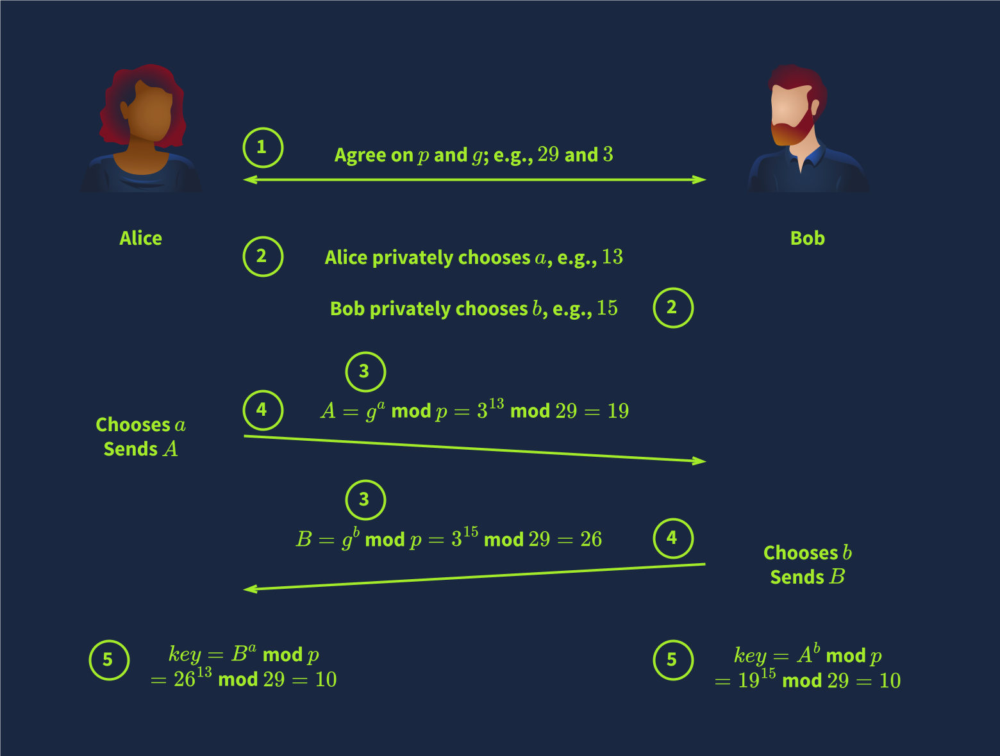

# Diffie-Hellman

**Key exchange** aims to establish a shared secret between two parties. It is a method that allows two parties to establish a shared secret over an insecure communication channel without requiring a pre-existing shared secret and without an observer being able to get this key. Consequently, this shared key can be used for symmetric encryption in subsequent communications.

1. Alice and Bob agree on the **public variables**: a large prime number $$p$$ and a generator $$g$$, where $$0 < g < p$$. These values will be disclosed publicly over the communication channel. Although insecurely small, we will choose $$p = 29$$ and $$g = 3$$ to simplify our calculations.
2. Each party chooses a private integer. As a numerical example, Alice chooses $$a = 13$$, and Bob chooses $$b = 15$$. Each of these values represents a **private key** and must not be disclosed.
3. It is time for each party to calculate their **public key** using their private key from step 2 and the agreed-upon public variables from step 1. Alice calculates $$A = ga$$ mod $$p = 313$$ mod $$29 = 19$$ and Bob calculates $$B = gb$$ mod $$p = 315$$ mod $$29 = 26$$. These are the public keys.
4. Alice and Bob send the keys to each other. Bob receives $$A = ga$$ mod $$p = 19$$, i.e., Alice’s public key. And Alice receives $$B = gb$$ mod $$p = 26$$, i.e., Bob’s public key. This step is called the **key exchange**.
5. Alice and Bob can finally calculate the **shared secret** using the received public key and their own private key. Alice calculates $$Ba$$ mod $$p = 2613$$ mod $$29 = 10$$ and Bob calculates $$Ab$$ mod $$p = 1915$$ mod $$29 = 10$$. Both calculations yield the same result, $$gab$$ mod $$p = 10$$, the shared secret key.

<figure><figcaption></figcaption></figure>
