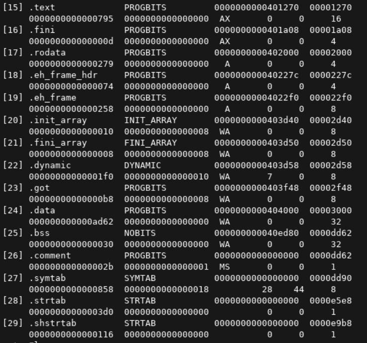

# Calculation


<figure><figcaption></figcaption></figure>


```python
asset_value = float(input("Asset value: "))
exposure_factor = float(input("Exposure Factor (%): ")) / 100

sle_before_safeguard = asset_value * exposure_factor
print(f"Single Loss Expectancy: {sle_before_safeguard}")

annual_risk_occurence = float(input("ARO: "))

ale_before_safeguard = sle_before_safeguard * annual_risk_occurence

print(f"Annualized Loss Expectancy before safeguard: {ale_before_safeguard}")

safeguard_cost = float(input("Safeguard Cost: "))

exposure_factor_after_safeguard = float(input("Exposure Factor (%) after safeguard: ")) / 100
annual_risk_occurence_after_safeguard = float(input("ARO after safeguard: "))

sle_after_safeguard = asset_value * exposure_factor_after_safeguard
ale_after_safeguard = sle_after_safeguard * annual_risk_occurence_after_safeguard

print("Single loss expectancy after safeguard: ", sle_after_safeguard)
print("Annualized loss expectancy after safeguard: ", ale_after_safeguard)
print("Value of safeguard: ", ale_before_safeguard - ale_after_safeguard - safeguard_cost)
```


